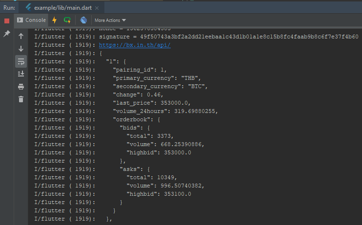

# Flutter BX Exchange 

Flutter BX Exchange is a Flutter's library for calling API of the [https://bx.in.th.](https://bx.in.th/)
package on [Pub.dev](https://pub.dev/packages/flutter_bx_exchange)

## Installation
Add dependencies in pubspec.yaml

```bash
flutter_bx_exchange: 1.0.1
```

## Usage

Import the package to your project.

```dart
import 'package:flutter_bx_exchange/bx_exchange_service.dart';
```

## Using Public API

Create instance without API Key. 

```dart
var bx = BxExchangeService();
```


### Market Data (Ticker)

Returns a list of all currency pairings including symbol currency, current price, volume in 24 hr, change in 24 hr.

This is a public API. you can access JSON in [https://bx.in.th/api/](https://bx.in.th/api/) directly.

```
[GET]
https://bx.in.th/api/
```

Using in Flutter.

```dart
List<BxPairCurrencyBxDao> list = await bx.fetchMarketData();
for(var currency in list){
    //    currency.pairingId;
    //    currency.primaryCurrency;
    //    currency.secondaryCurrency;
    //    currency.lastPrice;
    //    currency.volume24hours;
    //    currency.orderbook;
}
```


### Current Pairing Currency

Returns a list of all available currency pairings, including their "pairing_id" which is required for some API calls. Will also include the minimum order amount for primary and secondary currency in each pairing market.

This is a public API. you can access JSON in [https://bx.in.th/api/pairing/](https://bx.in.th/api/pairing/) directly.

```
[GET]
https://bx.in.th/api/pairing/
```

Using in Flutter.

```dart
List<BxPairCurrencyMetaDao> list = await bx.fetchCurrentPairings();
for(var currency in list){
    //    currency.pairingId;
    //    currency.primaryCurrency;
    //    currency.secondaryCurrency;
    //    currency.active;
    //    currency.primaryMin;
  }
```

### Order Book Summary

Returns a list of all buy and sell orders in the order book for the selected pairing market.

This is a public API. you can access JSON in [https://bx.in.th/api/orderbook/?pairing=1](https://bx.in.th/api/orderbook/?pairing=1) directly.

```
[GET]
https://bx.in.th/api/orderbook/?pairing={pairing_id}
```

Using in Flutter.

```dart
var orderbook = await bx.fetchOrderBook(pairingId: 1); // 1 is BTC/THB
//  orderbook.pairingsId;
//  orderbook.asks;
//  orderbook.bids;
```


### Recent Trade  

Returns a list of 10 most recent trades, and top 10 asks and bids in order book.

This is a public API. you can access JSON in [https://bx.in.th/api/trade/?pairing=1](https://bx.in.th/api/trade/?pairing=1) directly.

```
[GET]
https://bx.in.th/api/trade/?pairing={pairing_id}
```

Using in Flutter.

```dart
var recent = await bx.fetchRecentTrade(pairingId: 1); // 1 is BTC/THB
//  recent.pairingId;
//  recent.highBid;
//  recent.lowAsk;
//  recent.trades;
```

### Historical Trade Data  

Returns Weighted Average, Volume, Open, Close, Low and High prices for the specified date.

This is a public API. you can access JSON in [https://bx.in.th/api/tradehistory/?pairing=1&date=2019-01-01](https://bx.in.th/api/tradehistory/?pairing=1&date=2019-01-01) directly.

```
[GET]
https://bx.in.th/api/tradehistory/?pairing={pairing_id}&date={date}
```

```dart
var history = await bx.fetchHistoricalTradeData(pairingId: 1, date: "2019-07-01");
//  history.high;
//  history.low;
//  history.avg;
//  history.open;
//  history.volume;
```


## Prepare Private API

Prepare 3 API keys With different permissions.

### 1. General API key 

General API key are used for reading general information, such as balance, open orders , deposit address. 

```
required permissions : balance and deposit. 
```

### 2. Crate Order API key

Crate Order API key are used for creating order.

```
required permissions : create order. (Recommended to enable 2FA for safety.)
```


### 3. Cancel Order API key

Cancel Order API key are used for canceling order.

```
required permissions : cancel order. (Recommended to enable 2FA for safety.)
```

## Using Private API

Create instance with 3 API keys different permissions.

```dart
var bx = BxExchangeService(
  apiKeyGeneral:     BxApiKey(apiKey: "........", secret: "........"),
  apiKeyCreateOrder: BxApiKey(apiKey: "........", secret: "........"),
  apiKeyCancelOrder: BxApiKey(apiKey: "........", secret: "........"),
);
```


### Get Balance

Return all currencies with balance information including available, withdrawals, deposit, open order.

```dart
  var response = await bx.fetchBalance();
  if(response.success){
    var balances = response.balance;
    for(var balance in balances.listBalanceCurrency){
      //  balance.currency;
      //  balance.available;
      //  balance.deposits;
      //  balance.orders;
      //  balance.total;
      //  balance.withdrawals;
    }
  }else{
    print(response.error);
  }
```


### Get Open Orders

Returns current orders with option BUY / SELL.

```dart
  var response = await bx.fetchOpenOrders(pairingId: 1, orderType: BxTradeType.SELL);
    if(response.success){
    for(var order in response.orders){
      //  order.pairingId;
      //  order.orderId;
      //  order.orderType;
      //  order.rate;
      //  order.amount;
      //  order.date;
    }
  }else{
    print(response.error);
  }
```


### Get Transaction History

Get your own balance affecting transaction history, such as trades, withdrawals and deposits.

```dart
  var response = await bx.fetchTransactionHistory();
  if (response.success) {
    for (var tx in response.transactions) {
      //  tx.currency;
      //  tx.amount;
      //  tx.transactionId;
      //  tx.date;
      //  tx.type;
      //  tx.refId;
    }
  } else {
    print(response.error);
  }
```

You can add conditions to display various history transactions.

```dart
  var response = await bx.fetchTransactionHistory(
                              currency: "BTC", 
                              transactionType: BxTransactionType.WITHDRAW, 
                              startDate: "2019-01-01", 
                              endDate: "2019-05-01");
```


### Get Withdraw History

Return all transactions that about withdrawal.

```dart
  var response  = await bx.fetchWithdrawHistory();
  if(response.success){
    for(var tx in response.withdrawals){
      //  tx.transactionId;
      //  tx.currency;
      //  tx.amount;
      //  tx.address;
      //  tx.dateRequested;
      //  tx.withdrawalId;
      //  tx.withdrawalStatus;
    }
  }else{
    //  print(response.error); 
  }
```

### Get Deposit Address

Return deposit address of wallet.

```dart
  var response = await bx.fetchDepositAddress(currency: "BTC");
  if(response.success){
    // response.address;
  }else{
    print(response.error);
  }
```

Generate new deposit address.

```dart
  var response = await bx.fetchDepositAddress(currency: "BTC",generateNewAddress: true);
```

### Create Order

Create order to market require CREATE ORDER permission.
This method use Create Order API key.
The parameter require pairing id, tradeType, amount, rate.
2FA is a optional.

```dart
  var response = await bx.createOrder(
                          pairingId: 1, 
                          tradeType: BxTradeType.SELL, 
                          amount: 0.001, 
                          rate: 1000000, 
                          twoFactorAuth: '123456');
  if (response.success) {
     // response.orderId;
     // response.historyId;
  } else {
    print(response.error);
  }
```

### Cancel Order

Cancel order to market require CANCEL ORDER permission.
This method use Cancel Order API key.
The parameter require pairing id and order id.
2FA is a optional.

```dart
  var response = await bx.cancelOrder(
                        pairingId: 1,
                        orderId: 4567890,
                        twoFactorAuth: '123456');
  if (response.success) {
    //
  } else {
    print(response.error);
  }
```

## Other uses

Suggestions for other uses

### Pairing Currency ID

You can use BxPairCurrency class instead integer.

Example

```dart
var history = await bx.fetchHistoricalTradeData(pairingId: BxPairCurrency.THB_BTC);
```

### Print JSON

display JSON response on console or logcat.

```dart
await bx.fetchMarketData(printJson: true);
```



### Create Signature

Create a signature and display it on the console so you can apply this signature to other tools such as Postman.
and This signature will not be actually delivered to the server.

```dart
bx.printSignature(
              BxApiKey(
                apiKey: "123456789", 
                secret: "123456789"
              ));
```

Example displaying signature on console.

```dart
I/flutter ( 1919): apiKey = 123456789
I/flutter ( 1919): nonce = 1562569793537
I/flutter ( 1919): signature = 1ddf4d56df9a34abd83530d96d6df450fd3d2e2f0c910b55a79fbacce1e3e4ca
```


